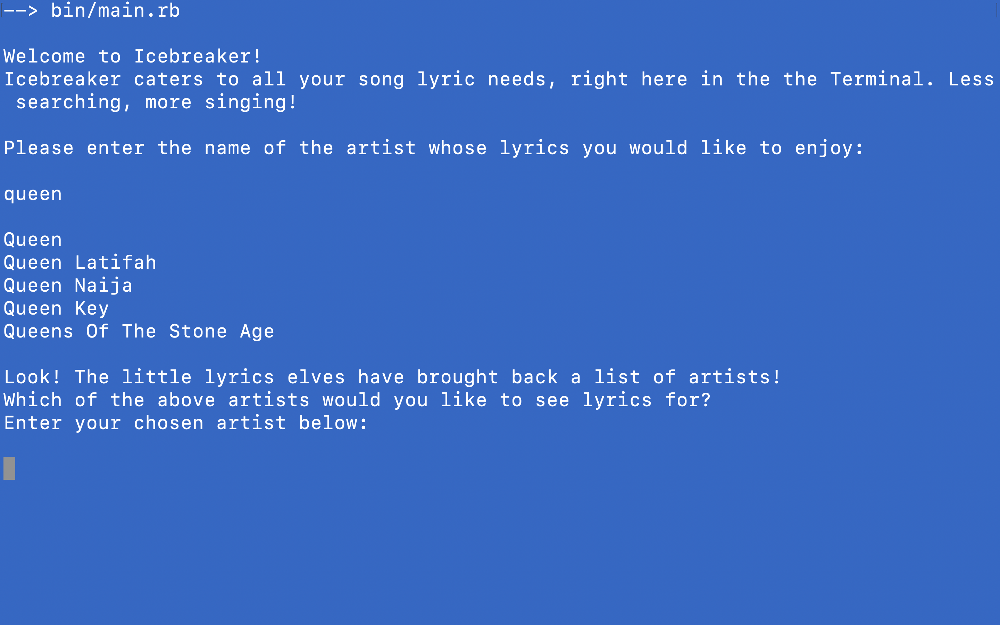
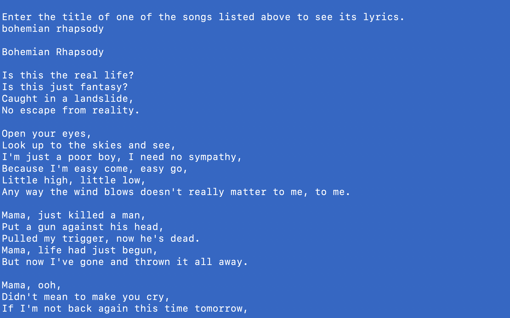
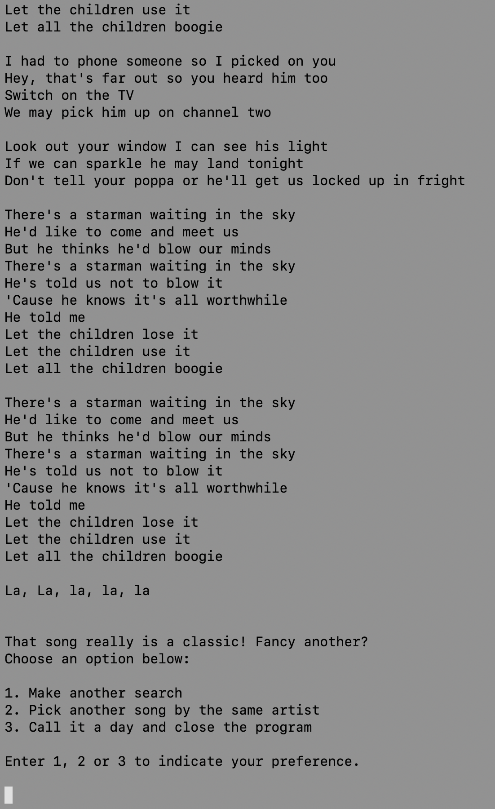
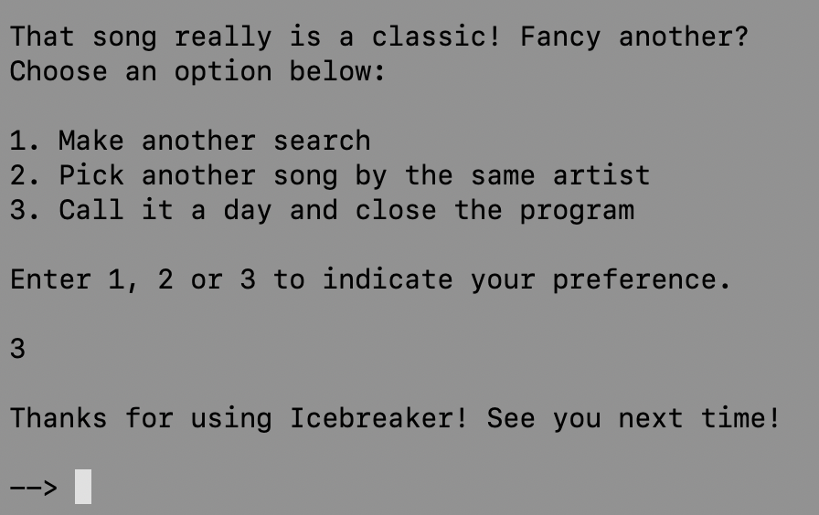

# Icebreaker

## What is Icebreaker?

**Icebreaker is a web-scraper that fetches and displays song lyrics.**

I created Icebreaker for the capstone project of Microverse's Ruby module. I was tasked with creating a web-scraper and, being a great lover of music and a great hater of adverts, I set about creating a tool that could provide lyrics to most popular, well-known music in a simple, quick and ad-free format.







## Built With

- Ruby
- Ruby gems: nokogiri, open-uri, pry, rspec
- Linted using Rubocop 
- Tested using RSpec

## Live Demo

[Live Demo Link](https://repl.it/@JosephBurke2/Icebreaker#lib/webpage.rb)

**IMPORTANT: Live Demo may hit an error "403 Forbidden" which is related to the open-uri gem. This can be avoided by opening the Live Demo in an incognito tab. Local access is recommended for reliability.**

---

## Access

### Quick Access

For those who want to jump right in, head to the [Live Demo](https://repl.it/@JosephBurke2/Icebreaker#lib/webpage.rb). You will be directed to a repl.it where you can immediately hit the "Run Code" button and see what happens.

### Local Access

For users who wish to store the project locally, follow these instructions:

### Prerequisites

First, make sure you have the following already set up on your computer, and follow the links if not.

- [Ruby](https://www.ruby-lang.org/en/downloads/)
- [Nokogiri](https://nokogiri.org/)
- [Open-uri] - (Ships as part of Ruby, no need to install additionally)
- [RSpec](https://rubygems.org/gems/rspec/versions/3.4.0) (Optional, for testing)

### Setup

1. The first step is to choose a location in your computer to download the project into.
2. Open a Terminal and navigate into your chosen location using [The Command Line](https://lifehacker.com/a-command-line-primer-for-beginners-5633909).
3. Once inside your desired location, enter the following code: 
```
git clone https://github.com/Joseph-Burke/Icebreaker
```
4. After a few short moments, the project will be downloaded. Navigate into it with `cd Icebreaker`
5. You're now inside the downloaded project! Congratulations. From here, the line of code you need in order to run Icebreaker is simply:
```
ruby bin/main.rb
```
6. Icebreaker will commence in the Terminal window, and all you have to do are follow its instructions. The lyrics of the world's best songs are now at your fingertips.

### Instructions

> As mentioned above, Icebreaker needs no instructions due to its beautiful crafstmanship. You will first be asked to enter a name of an artist to search for. 

> Once the results of that search are displayed, You will be asked to enter the name of the artist you want and that artist's songs will then be listed, ordered by album.

> Once again, type in your selection and the lyrics will be displayed. From there, Icebreaker will ask you for further direction (see below). Enter a number - 1, 2, or 3 - to search for a new song, see more songs from the same artist or exit Icebreaker.



### Usage

**Note: While all major errors and bugs have been addressed, the time-critical nature of this capstone project has meant that certain weaknesses/areas-for-improvement remain:**

1. **The program requires exact input.** Icebreaker is not case-sensitive and can deal with leading/trailing whitespace. But aside from that, it will not recognise any selection you make if the characters are not precisely the same. For long artist/song titles, a little bit of copy and paste goes a long way.
2. **Single-item search results:** It is often the case that the first piece of information you give Icebreaker will return only one artist. It was my intention to have an automatic selection occur in this case. *Alas, it was not to be*. If your first search is 'the beatles', Icebreaker will return one search result: "The Beatles". You will then have to re-enter "the beatles" in order to select that search result and navigate to The Beatles' artist view.

### Run tests
1. If RSpec is installed, simply run `rspec` from the project's root directory to run the 20+ tests in its ./spec folder.

---

### Project Structure

- **./bin:** The bin folder contains only the **main.rb** file. This is the executable file, and the only file to contain puts and gets methods.
- **./lib:** The lib folder contains class, method and constant definitions that are involved in the program:
  
  1. **program.rb** for the Program class. This class possesses the majority of the methods called in bin/main.rb
  2. **webpage.rb** for the WebPage class. This class is concerned with gathering and processing the html documents are then scraped for relevant information.
  3. **printable.rb** contains the Printable module. This module is included in the Program class and is simply a means of storing uncomplicated, space-consuming methods out of sight.
  4. **string.rb** contains the String class, which I have added 3 utility methods to.

- **./spec:** The spec folder is automatically created by RSpec. Since string.rb and printable.rb only contain very simple methods, I have opted not to create test for them.

**Note: While my preference would have been to store many more methods privately within classes, this would have prevented me from testing them, so for that reason they have been left as public methods.**

## Authors

👤 **Joseph Burke**

  **Say hello! I don't bite.**

- Github: [@Joseph-Burke](https://github.com/Joseph-Burke)
- Twitter: [@__joeburke](https://twitter.com/__joeburke)
- LinkedIn: [Joseph Burke](https://www.linkedin.com/in/joseph-burke-b7a8261a5)

## 🤝 Contributing

Contributions come in all shapes and sizes.

Feedback on my work is always massively appreciated.

Likewise, any contributions of any kind - corrections, suggestions, issues, feature requests - will benefit the project. 

## Show your support

If you've read this far...give it a ⭐️!

## Acknowledgments

- As ever, a big thank you to my stand-up team for their support and comradery.
- Thanks, Microverse.

## 📝 License

This project is NOT MIT licensed due to the licensing of the source website.
